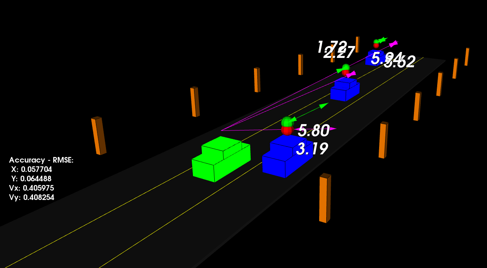

# Unscented-Kalman-Filter-with-LiDAR-and-Radar

Fusion of noisy LiDAR and Radar sensor measurements to estimate the states of multiple cars on highway using Unscented Kalman Filter(UKF). The point cloud generated using LiDAR's data and velocity measurements from Radar's data, one can get a better understanding of the scene.
<br/>

```highway.h``` has been used to create a highway with three traffic cars and main ego car at the center. The scene has been centered around the ego car and the coordinate system is relative to the ego car. The traffic cars accelerate and altering their steering to change lanes.
<br/><br/>

Each of the traffic car's has its own UKF object generated for it, and will update each individual one during every time step using Constant Turn Rate and Velocity (CTRV) motion model.
<br/><br/>

The accuracy will be evaluated by the Root Mean Squared Error (RMSE) over each time step and for each car.
<br/><br/>

The red spheres above cars represent the (x,y) lidar detection and the purple lines show the radar measurements with the velocity magnitude along the detected angle. The green spheres above cars represent the predicted path that cars would move in the near future.
<br/><br/>

On the left-hand side, the root mean squared errors (RMSE) for position (x,y) and velocity (Vx, Vy) are calculated in realtime, which represent the prediction accuracy.



## Results

I experimented different initial values for the state vector x_, covariance matrix P_, standard deviation of longitudinal acceleration noise std_a_, standard deviation of yaw acceleration noise std_yawdd_. And the following parameters serve the best result. The RMSE values are always within the thresholds during the simulation.


### Build requirements
- cmake >= 3.5
    * All OSes: [click here for installation instructions](https://cmake.org/install/)
- make >= 4.1 (Linux, Mac), 3.81 (Windows)
    * Linux: make is installed by default on most Linux distros
- gcc/g++ >= 5.4
    * Linux: gcc/g++ is installed by default on most Linux distros
- PCL 1.2

### Build instructions
```
$ git clone https://github.com/ayushgoel24/Unscented-Kalman-Filter-with-LiDAR-and-Radar $Unscented-Kalman-Filter-with-LiDAR-and-Radar
$ mkdir -p Unscented-Kalman-Filter-with-LiDAR-and-Radar/build && cd Unscented-Kalman-Filter-with-LiDAR-and-Radar/build
$ cmake .. && make
$ ./ukf_highway
```